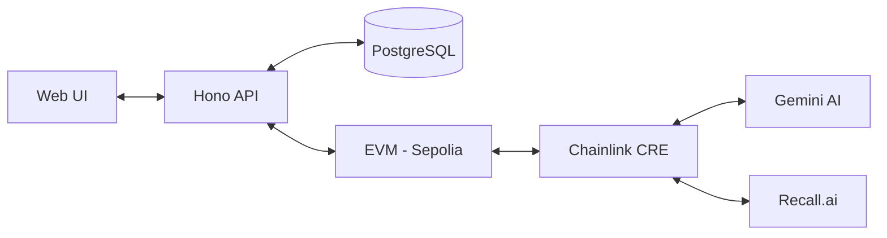

Verity combines traditional web layers with trustless blockchain execution via Chainlink CRE.

## System Overview



### 1. Web Layer (Hono & React)
The web layer facilitates the user experience and handles non-critical logistics:
- **Meeting Generation**: Integrates with Google Calendar API for Meet URLs.
- **Data Caching**: Caches on-chain data for fast dashboard performance.
- **Auth**: Managed via Privy for seamless wallet-first onboarding.

### 2. CRE Workflows (Oracles)
Verity uses **Chainlink CRE** to autonomously evaluate sessions:
- **Initiation**: Bridges on-chain booking to off-chain bot deployment.
- **Settlement**: Fetches transcripts, runs AI evaluation via Gemini, and settles payments on-chain.

### 3. Smart Contracts (Solidity)
- **KXManager**: Handles listings and session initiation.
- **KXSessionRegistry**: Manages the USDC escrow and merit-based settlement logic.

## Settlement Math
Verity uses a **Quadratic Payout** formula to reward quality:
```solidity
uint16 effective = (confidenceBps + learningBps) / 2;
uint256 teacherShareBps = (uint256(effective) * uint256(effective)) / 10000;
```
This ensures that "Excellent" sessions receive significantly higher rewards than "Moderate" ones.
