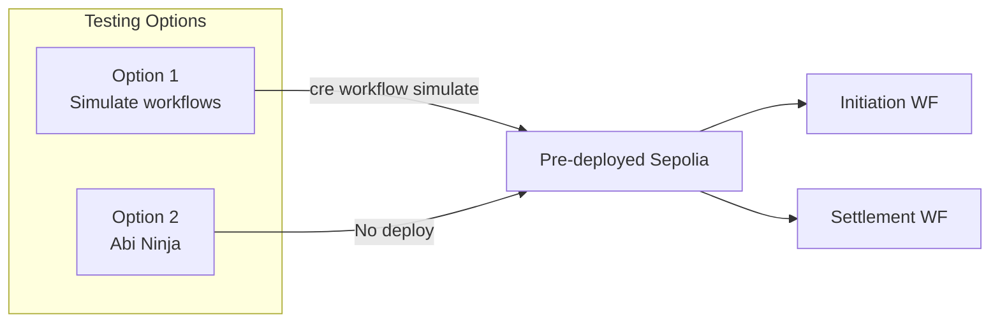

This guide helps you test the Verity CRE workflows — the initiation and settlement workflows that power AI evaluation and on-chain settlement.



---

## Prerequisites

Before testing, ensure you have:

| Requirement | Purpose |
| ----------- | -------- |
| [Bun](https://bun.sh/) | JavaScript runtime for workflows |
| [CRE CLI](https://docs.chain.link/chainlink-runtime-environment) | Chainlink Runtime Environment CLI |
| [AI API Key](https://aistudio.google.com/api-keys) | Gemini or OpenAI-compatible API for evaluation |
| [Pinata JWT](https://app.pinata.cloud/) | IPFS storage for session metadata |
| [Recall API Key](https://www.recall.ai/) | Meeting recording and transcript fetching |
| [ETH on Sepolia](https://faucets.chain.link/) | Gas for workflow transactions |
| [USDC on Sepolia](https://faucet.circle.com/) | Session payments (for full end-to-end) |

---

## Option 1: Simulate CRE Workflows (Fastest)

Test the workflows without running the full app. Uses pre-deployed contracts on Sepolia.

### 1. Install dependencies

```bash
cd packages/contracts/workflows/initiation-workflow
bun install

cd ../settlement-workflow
bun install
```

### 2. Configure environment

Create `.env` from the example and populate:

```bash
cp .env.example .env
```

**Required variables:**

| Variable | Purpose |
| -------- | ------- |
| `CRE_ETH_PRIVATE_KEY` | Private key with Sepolia ETH for gas |
| `OPENAI_COMPAT_API_KEY` | Gemini or OpenAI API key for AI evaluation |
| `PINATA_API_JWT` | Pinata JWT for IPFS uploads |
| `RECALL_API_KEY` | Recall.ai API key for transcripts |

### 3. Run simulations

```bash
# From initiation-workflow directory
cre workflow simulate . --target=test

# From settlement-workflow directory
cre workflow simulate . --target=test
```

Or use full paths:

```bash
cre workflow simulate ./packages/contracts/workflows/initiation-workflow --target=test
cre workflow simulate ./packages/contracts/workflows/settlement-workflow --target=test
```

**Config:** `packages/contracts/workflows/project.yaml` defines the Sepolia RPC for `test` target.

---

## Option 2: Test with Abi Ninja (No Deploy)

Use [Abi Ninja](https://abi.ninja/) to interact with pre-deployed contracts without running the full stack.

### 1. Connect to Sepolia

- In Abi Ninja, select **Ethereum Sepolia**
- Connect a wallet with Sepolia ETH and USDC

### 2. Load contract addresses

| Contract | Address |
| -------- | ------- |
| USDC | `0xb243a36d2cb3937b40043050bf4f7d36795322db` |
| KXManager | `0x42c105b36825778ca323bf850df6e007b0407dca` |
| KXSessionRegistry | `0xB9f475C996A61c8BC9b2E72B7Df3de3017Dd3C76` |

ABIs are in `definitions.gen.ts` in the project.

### 3. Test key functions

**Create listing** (KXManager):

- `createListing(dataCID, price)`
- Example: `dataCID` = `"Qm..."` (IPFS CID), `price` = `1000000` (1 USDC, 6 decimals)

**Request session** (KXManager):

- `approve` USDC for KXManager first
- `requestSessionRegistration(listingIndex, meetingLink)`
- Example: `listingIndex` = `0`, `meetingLink` = `"https://meet.google.com/..."`

**Request evaluation** (KXSessionRegistry):

- `requestEvaluation(sessionId)` — triggers the settlement workflow

**Claim payouts** (KXSessionRegistry):

- `claimTeacher(sessionId)` or `claimLearner(sessionId)` — host and attendee claim after evaluation

### 4. Monitor events

Watch for:

- `SessionRegistrationRequested` — initiation workflow triggered
- `SessionRegistered` — session on-chain
- `EvaluationRequested` — settlement workflow triggered
- `SessionEvaluated` — AI scores received, payout calculated
- `TeacherClaimed` / `LearnerClaimed` — host and attendee funds distributed

---

## Security

- **Demo project** — Not audited; use testnet only
- **Secrets** — Never commit `.env` or private keys
- **Amounts** — Use small test amounts
- **AI evaluation** — May have biases; verify outputs
- **Gas** — Workflow transactions consume ETH from your account
