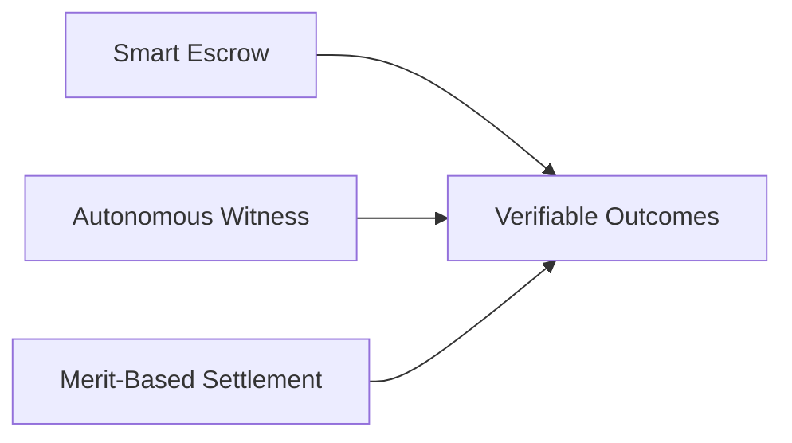
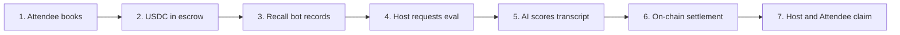
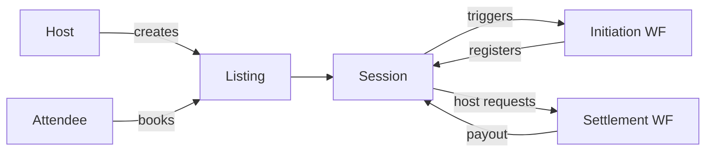

**"Don't just consult. Verify with Verity."**

Verity replaces blind trust with **Verifiable Outcomes**. It ensures experts are paid for their impact and attendees only pay for what they actually gain.

## Core Value Proposition

Verity eliminates the "Trust Gap" using three pillars:

## How It Works

Verity uses **Chainlink CRE** to autonomously evaluate teaching sessions and settle payments based on AI-verified quality metrics.

**Key Innovation:** AI evaluation happens via Chainlink DON, not a centralized server — making it trustless and verifiable.

**Value Proposition:**

- **Trustless:** AI evaluation via Chainlink DON, verifiable by anyone
- **Fair:** Quadratic scoring rewards high-quality teaching
- **Autonomous:** No human in the loop — session completes → AI evaluates → payment flows

## Key Terms

- **Listing** — A host's offer: topic, price in USDC, and metadata (stored as `dataCID` on IPFS).
- **Session** — A booked instance of a listing between a host and attendee. Funds are held in escrow until evaluation.
- **Initiation Workflow** — Triggered when an attendee requests a session. Registers the session on-chain and sets up recording.
- **Settlement Workflow** — Triggered when a host requests evaluation. Scores the transcript via AI and settles payouts on-chain.

## Core Protocol Features

### Smart Escrow System

- **Secure Fund Locking**: USDC funds locked in escrow before sessions begin.
- **No Payment Risk**: Hosts get guaranteed payment, attendees get guaranteed refunds.
- **Instant Settlement**: Funds automatically distributed after evaluation.

### AI-Powered Session Evaluation

- **Autonomous Witness**: Recall.ai bots automatically join and record sessions.
- **Multi-Criteria Assessment**: Evaluates topic relevance, depth, engagement, substance, time usage, and clarity.
- **Weighted Goals**: Custom success criteria with importance weighting.
- **Confidence Scoring**: AI provides confidence levels for evaluation reliability.

### Merit-Based Payment System

- **Quadratic Payout Formula**: `((confidence + learning)/2)^2` determines payment percentage.
- **Transparent Scoring**: Detailed breakdown of how scores translate to payouts.
- **Instant Finality**: No chargebacks or payment disputes.

### Session Management

- **Cross-Platform Support**: Zoom, Google Meet, and Microsoft Teams integration.
- **State Tracking**: Complete session lifecycle from creation to settlement.
- **Real-time Status**: Live updates on session progress and recording status.
