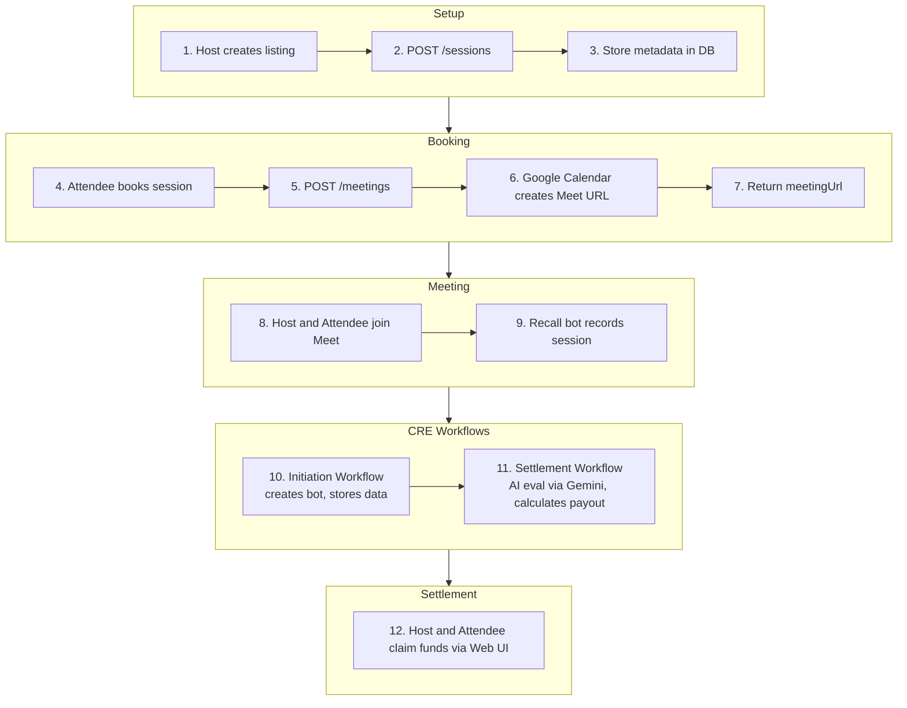

Verity orchestrates a trustless exchange of knowledge between Hosts and Attendees.

---

## The Host Journey

### 1. Setup & Discovery

- **Connect Wallet**: Access your dashboard by connecting your EVM wallet.
- **Create Session**: Define your offering with a topic, duration, and price in USDC.
- **Define Goals**: Establish **weighted learning goals** (e.g., "Deploy ERC-20 contract" - Weight 5/5).

### 2. Session Execution

- **Wait for Attendee**: Once an attendee funds the escrow, you'll be notified.
- **Start Meeting**: The Verity bot (Recall.ai) automatically joins to record the session.
- **Teach**: Deliver your session as planned.

### 3. Evaluation & Settlement

- **Request Evaluation**: Click "Request Evaluation" after the meeting ends.
- **Receive Results**: AI processes the transcript (2-5 min) and calculates your merit score.
- **Claim Funds**: Earnings are available to claim immediately to your wallet.

---

## The Attendee Journey

### 1. Discovery & Booking

- **Find a Host**: Browse available sessions and review host ratings and goals.
- **Join Session**: Enter the session code provided by your host.

### 2. Payment & Access

- **Fund Escrow**: Approve and lock the USDC amount in the smart contract.
- **Join Meeting**: Access the meeting link provided in the dashboard.

### 3. Results & Refund

- **AI Evaluation**: Wait 2-5 minutes for the AI to analyze the transcript.
- **Claim Refund**: If the session goals weren't fully met, your refund portion is available to claim immediately.

---

## Complete Session Flow

The end-to-end flow from listing creation to fund distribution:

**Steps 1-9:** Web layer (UI, server, database) — see [Server and Client](/server-and-client).

**Steps 10-11:** Chainlink CRE workflows run autonomously — no server involvement. See [Contracts and CRE](/contracts-and-cre).

**Step 12:** Host and attendee claim funds via the Web UI after the on-chain settlement completes.
