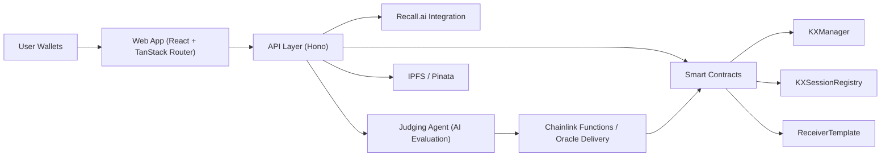
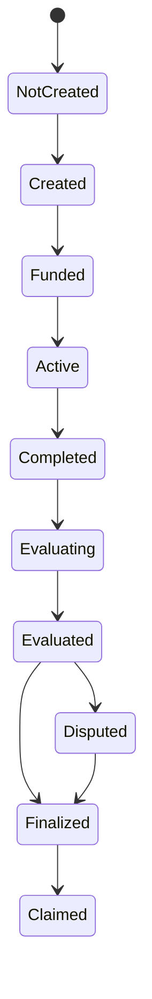

## High-level architecture

## Core components

### Frontend

- TanStack file-based routing
- Demo flows at `/demo/*`
- Planning board at `/mockup`

### Backend

- Hono handlers for sessions, meetings, goals, users, and AI
- Integration orchestration for meeting evidence and scoring

### Contracts

- `KXSessionRegistry` for escrow and state transitions
- `KXManager` for report ingestion/orchestration
- `ReceiverTemplate` for secure off-chain report delivery

## State machine

