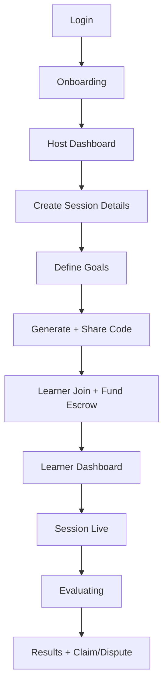

## End-to-end flow

## Host flow

1. Open host dashboard.
2. Create session details.
3. Define weighted success criteria.
4. Share code and meeting link.
5. Run session and trigger evaluation.
6. Claim payout after finalization.

## Learner flow

1. Enter session code.
2. Review profile, goals, and cost.
3. Approve token and fund escrow.
4. Join live session.
5. Claim refund delta if applicable.

## Demo routes

- `/demo`
- `/demo/login`
- `/demo/onboarding`
- `/demo/host/dashboard`
- `/demo/host/create/details`
- `/demo/host/create/goals`
- `/demo/host/create/share`
- `/demo/learner/join`
- `/demo/learner/dashboard`
- `/demo/session/live`
- `/demo/session/evaluating`
- `/demo/session/results`

## Failure recovery

- Funding failure: top-up and retry.
- Bot failure: fallback recording path.
- Network failure: retry and track transaction hash.
